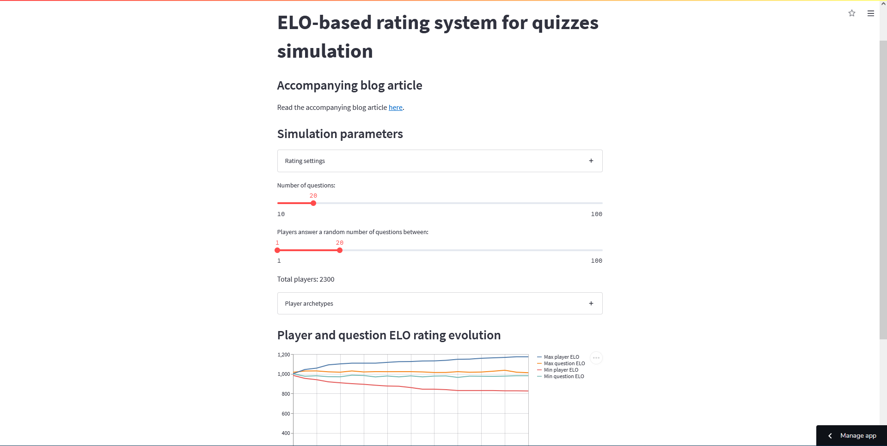
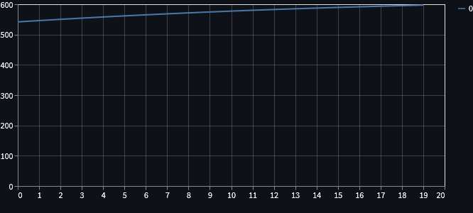
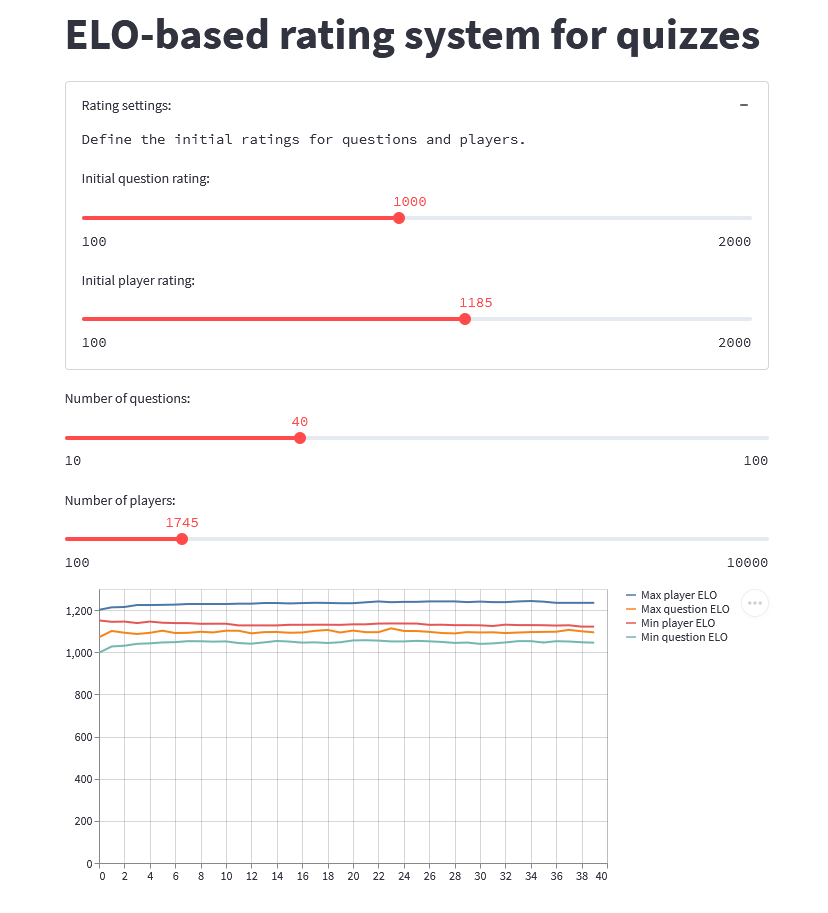
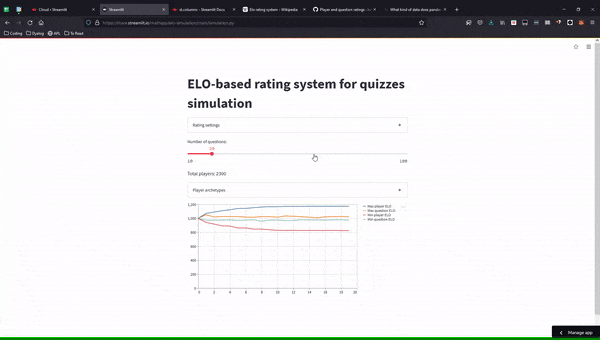

Join me as I create a simulation that tries to test an ELO-based rating system for quizzes.

===




# Introduction

In this article, I will tell you about a simulation that I built.
This simulation is built around a rating system that is based off of the [ELO rating system][ELO],
and I will use [Streamlit][streamlit-til] to build the app that will control the simulation.
This will also make it easier to share the simulation with others.

In short, I'll be walking you through the process of writing [this code][gh-repo] and,
in the end, the code I linked to in that GitHub repository is going to be used
to host the Streamlit web app that you can play with live, [here][streamlit-app].

The screenshot above also refers to the same Streamlit web app.


# ELO-based rating system for quizzes

What I'm trying to do is design a decent rating system for a quiz app.
The idea is that the quiz questions will have a rating,
and so will the “players”: the people answering the quiz.

Every time a person answers a question, their rating gets adjusted depending on whether they answered the question correctly.
Similarly, the question's rating gets updated.
If the player answers correctly, the player's rating goes up and the question's goes down.
If the player answers incorrectly, the ratings change the other way around.

So, how can we build such a system?

The [ELO rating system][ELO] is a system that attributes a numeric rating to players,
in order to determine the relative skill of the players.
The ELO rating is probably best known for being the rating used in chess.

I have seen the website chess.com use an ELO-like system for their chess problems:
you play the problem and, if you get it right, your problem-solving rating increases;
at the same time, the rating of the problem decreases.
If you get it wrong, vice-versa.
I want to try and mimic this functionality.

The purpose of building a simple simulation is to try and see if my assumptions
about the rating system work, or if the system will go bonkers when used in real life!
Of course, the simulation will represent a simplification of reality:

 - if the simulation shows bad behaviour, then the system probably won't work in real life; but
 - if the simulation shows good behaviour, then _maybe_ the system will work in real life.


# Updating the rating

The key thing that I need is the formula to update the rating when two players face each other off.
If we scroll the Wikipedia article to the section that mentions the mathematical details,
we get what we need.

Suppose that players $A$ and $B$ have ratings $R_A$ and $R_B$, respectively.
The ELO rating system determines how well it _thinks_ each player should perform,
when compared to the other player.
In other words, the ratings $R_A$ and $R_B$ don't really say how good – or how bad –
each player is; the ratings only say how much better – or how much worse –
player $A$ is when compared to player $B$.

So, when $A$'s rating is higher than $B$, the ELO rating system expects $A$ to do well against $B$.
How is this translated into maths?

Well, let's assume that the match between $A$ and $B$ has a score between $0$ and $1$.
From each player's point of view, $1$ means a complete victory and $0$ means a complete defeat.
For games like chess, a match only has three possible outcomes:

 - $0$ when the player loses;
 - $0.5$ when the players draw; and
 - $1$ when the player wins.

So, by using a formula, we can determine what is the _expected score_ for each player.
When the player $A$ is going against player $B$, its score is _expected_ to be:

$$
E_A = \frac{1}{1 + 10^{(R_B - R_A)/400}} ~ .
$$

What's that $400$ in there?
It is just a scaling factor.
To be 100% honest with you,
I don't really feel like explaining what that means, so let's leave it at that.

So, after we know the _expected_ score for player $A$,
we need the formula to update its rating.
First, we need to figure out the _actual_ score,
which we will call $S_A$.
Then, the updated rating for player $A$ becomes

$$
R'_A = R_A + K(S_A - E_A) ~ .
$$

In the above, $K$ is another constant that we set up.
The constant $K$ defines the maximum amount by which a rating can vary from a single game.
For example, if $K = 100$, then $100$ is the maximum number of rating points we can win or lose from a single match.
If $K$ is too large, then ratings fluctuate too much; and if $K$ is too small, ratings barely change.

Because of this nuance in the usage of $K$,
it is common practice to start off with a larger value of $K$,
and then reduce it up until it reaches a lower value.
We will do this in our code.

To compute the change in $B$'s rating, we swap all the $A$'s and $B$'s above.
Also, note that $E_A + E_B = 1$ and $S_A + S_B = 1$ or, in other words,

$$
\begin{align}
E_B &= 1 - E_A \\
S_B &= 1 - S_A
\end{align} ~ .
$$


# Implementing rating changes

Now that we have the mathematical formulas that drive the rating changes,
we can write some code that implements these mechanics.
Let's start by defining a plain Python class that represents a rated entity.

! In the code, I'm calling this a rated _entity_ (instead of _player_) because quiz questions
! will also be rated, and questions are not players.

Here is the code for the rated entity:

```py
from __future__ import annotations


SCALE_FACTOR = 400


class RatedEntity:
    """Represents an entity that has an ELO-like numerical rating."""

    def __init__(self, rating: float, K: int):
        self.rating = rating
        self.K = K

    def expected_score(self, other: RatedEntity) -> float:
        """Compute the expected score when facing the other rated entity."""
        return 1 / (1 + pow(10, (other.rating - self.rating) / SCALE_FACTOR))

    def update_score(self, expected: float, actual: float):
        """Update the rating according to the given scores."""
        self.rating += self.score_delta(expected, actual)

    def score_delta(self, expected: float, actual: float) -> float:
        """Compute how much the rating would change according to the given scores."""
        return self.K * (actual - expected)


if __name__ == "__main__":
    # Wikipedia examples.
    A = RatedEntity(1613, 32)
    print(A.expected_score(RatedEntity(1609, 32)))  # Should give approximately .51
    print(A.score_delta(2.88, 2.5))  # Should give approximately -12.
```

This provides the basic functionality, but we still need some other things to drive the simulation.


# Player archetypes

For the simulation to run, we need to simulate the way in which players answer the questions.
For that, we will create some player archetypes:

 - players that get all questions right;
 - players that get all questions wrong;
 - players that get questions right with 50% chance;
 - etc.

Then, the point of the whole simulation will be to have those different types of players answer the different questions,
and we'll see how the ratings of the players and of the questions evolve.

So, without further ado, let's create some player archetypes.
On top of that, we create classes that represent all players and all questions,
because those will model the evolution of the $K$ parameter as the ratings get updated.

Here is how we define the class that represents questions,
and the class that all player archetypes will inherit from:


```py
from abc import ABC, abstractmethod
from random import uniform


SCALE_FACTOR = 400
INITIAL_PLAYER_K = 32
FINAL_PLAYER_K = 16
INITIAL_QUESTION_K = 32
FINAL_QUESTION_K = 8


class RatedEntity:
    # ...


class Question(RatedEntity):
    """Represents a question with an ELO rating.

    A question is a rated entity that defines a strategy to handle the evolution
    of the K factor.
    """

    def __init__(self, rating: float):
        super().__init__(rating, INITIAL_QUESTION_K)

    def update_K(self):
        """Define the strategy to evolve K over time."""
        self.K = max(FINAL_QUESTION_K, self.K - 1)

    def update_score(self, expected: float, actual: float):
        """Update the score of the rated entity and then update K."""
        super().update_score(expected, actual)
        self.update_K()


class Player(RatedEntity, ABC):
    """Represents a player with an ELO rating.

    A player is a rated entity that provides a (possibly random) function
    that determines the score the player would get when answering a question.
    This class also defines a strategy to handle the evolution of the K factor.
    """

    def __init__(self, rating: float):
        super().__init__(rating, INITIAL_PLAYER_K)

    @abstractmethod
    def generate_score(self) -> float:
        """Generates the answering score of the player following its archetype."""
        pass

    def update_K(self):
        """Define the strategy to evolve K over time."""
        self.K = max(FINAL_PLAYER_K, self.K - 1)

    def answer_and_update(self, question: RatedEntity):
        """Answer a question and update own and question's ratings."""
        expected_score = self.expected_score(question)
        actual_score = self.generate_score()
        self.update_score(expected_score, actual_score)
        question.update_score(1 - expected_score, 1 - actual_score)
        self.update_K()
```

After we defined these two main classes, we can implement a bunch of archetypes.
Really, we can just let our imagination go wild.
Here are a couple of archetypes I came up with:

```py
# ...

class AlwaysRight(Player):
    """A player that gets all questions correctly."""
    def generate_score(self) -> float:
        return 1


class AlwaysMid(Player):
    """A player that always gets all questions half-right."""
    def generate_score(self) -> float:
        return 0.5


class AlwaysWrong(Player):
    """A player that gets all questions incorrectly."""
    def generate_score(self) -> float:
        return 0


class UsuallyRight(Player):
    """A player with a uniformly distributed score in [0.3, 1]."""
    def generate_score(self) -> float:
        return uniform(0.3, 1)


class UsuallyWrong(Player):
    """A player with a uniformly distributed score in [0, 0.7]."""
    def generate_score(self) -> float:
        return uniform(0, 0.7)
```

There is one thing here that I thought about,
but that I don't know how it will affect the simulation:
the simulated scores for the player archetypes are _not_ taking into account
the ratings of the questions they are answering.
This will certainly influence the results we get.


# Running the simulation

Now that we have some code to represent players and questions, we want to create the simulation.
Let's start with something basic:

 - we'll provide sliders to define initial ratings for players and questions;
 - we'll provide sliders to define the amount of questions and players; and
 - we'll plot _something_ just to make sure that plotting works.

Here is the code I wrote in a file called `simulation.py`:

```py
import streamlit as st

from player import Question, AlwaysRight


st.title("ELO-based rating system for quizzes")

with st.expander("Rating settings:"):
    st.text("Define the initial ratings for questions and players.")
    INITIAL_Q_RATING = st.slider(
        "Initial question rating:", min_value=100, max_value=2000, value=1000
    )
    INITIAL_PLAYER_RATING = st.slider(
        "Initial player rating:", min_value=100, max_value=2000, value=1000
    )

QUESTIONS = st.slider("Number of questions:", min_value=10, max_value=100, value=20)
PLAYERS = st.slider("Number of players:", min_value=100, max_value=10_000, value=300)

players = [AlwaysRight(INITIAL_PLAYER_RATING) for _ in range(PLAYERS)]
questions = [Question(INITIAL_Q_RATING) for _ in range(QUESTIONS)]

plot = st.line_chart([])

for q in questions:
    for p in players:
        p.answer_and_update(q)
    plot.add_rows([q.rating])
```

Running the simulation with the default values set in that code should produce a plot similar to this one:



The plot that we can see above contains the final rating of each one of the questions.
As we can see, later questions have a slightly higher rating.
Why?

For now, the simulation is _really_ basic:
it goes through the questions, one by one, and then _all_ players answer that question right.
This makes it so that the first questions are answered when the players have lower ratings,
which means that the ratings of the first questions are pushed down harder:
if a player has a rating much higher than that of a question and then answers the question correctly,
the player rating increases only slightly, and the rating of the question decreases only slightly.


# Shuffling answering order

The first thing we can do to make the simulation a bit more interesting is shuffle the order in which the players answer the questions.
In order to do that, we will associate each player with a queue of questions that they have to answer,
and we'll give each player a method `answer_next` that answers the next question in that queue.
Each player's list will be shuffled, and so will the order in which players answer questions.

First, here is the method I mentioned for the players:

```py
# player.py
# ...

class Player(RatedEntity, ABC):
    """Represents a player with an ELO rating.

    A player is a rated entity that provides a (possibly random) function
    that determines the score the player would get when answering a question.
    This class also defines a strategy to handle the evolution of the K factor.
    """

    def __init__(self, rating: float, question_queue: list[Question]):
        super().__init__(rating, INITIAL_PLAYER_K)
        self.question_queue = question_queue  # Keep track of queue of questions.

    # ...

    def answer_next(self):
        """Takes the next question in the player queue and answers it."""
        self.answer_and_update(self.question_queue.pop())
```

Now that players need a list of questions,
we need to modify the simulation code to pass that queue in when creating the player:

```py
# simulation.py
# ...

questions = [Question(INITIAL_Q_RATING) for _ in range(QUESTIONS)]
players = []
for _ in range(PLAYERS):
    random.shuffle(questions)
    players.append(UsuallyRight(INITIAL_PLAYER_RATING, questions[::]))
```

When creating each player, we need to pass it in a **copy** of the list of questions,
otherwise the mutability of lists would bite us and every player would have the questions in the same order.

After creating these questions and these players, we need to start the simulation:

```py
# simulation.py
# ...

while players:
    idx = random.randint(0, len(players) - 1)
    players[idx].answer_next()
    if not players[idx].question_queue:
        players.pop(idx)
```

We pick a random player and answer its next question.
Then, we just check if the player is done answering all their questions.

Now, what do we plot?


# Plotting useful information

Well, it never really made much sense to plot the final rating of each question.

We are more interested in data that shows the evolution of the ratings during the simulation,
not just the final results.
What we can do is plot the min/max question/player ratings every once in a while:

```py
# simulation.py
# ...

questions = [Question(INITIAL_Q_RATING) for _ in range(QUESTIONS)]
players = []
for _ in range(PLAYERS):
    random.shuffle(questions)
    players.append(UsuallyRight(INITIAL_PLAYER_RATING, questions[::]))
all_players = players[::]

plot = st.line_chart(
    {
        "Min question ELO": [],
        "Max question ELO": [],
        "Min player ELO": [],
        "Max player ELO": [],
    }
)

c = 0
while players:
    idx = random.randint(0, len(players) - 1)
    players[idx].answer_next()
    if not players[idx].question_queue:
        players.pop(idx)

    c = (c + 1) % PLAYERS
    if not c:
        plot.add_rows(
            {
                "Min question ELO": [min(q.rating for q in questions)],
                "Max question ELO": [max(q.rating for q in questions)],
                "Min player ELO": [min(p.rating for p in all_players)],
                "Max player ELO": [max(p.rating for p in all_players)],
            }
        )
```

After running the simulation and playing around with the sliders,
this is what I got:




# Finer control over player archetypes

Now that our simulation prints some useful information,
let's add more control over the types of players present in the simulation.
(As of now, we only had a single type of player present!)

We create an expandable section with a series of sliders,
and we also have to tweak slightly the loop that creates the players:

```py
from player import (
    Question,
    AlwaysRight,
    AlwaysMid,
    AlwaysWrong,
    UsuallyRight,
    UsuallyWrong,
)


PLAYER_COUNT_TEMPLATE = "Total players: {:>4}"

# Sliders about ratings and number of questions...

player_count_label = st.text(PLAYER_COUNT_TEMPLATE.format("??"))
player_archetypes = [AlwaysRight, AlwaysMid, AlwaysWrong, UsuallyRight, UsuallyWrong]
with st.expander("Player archetypes"):
    player_counts = [
        st.slider("Always right:", min_value=0, max_value=10_000, value=100),
        st.slider("Always half-right", min_value=0, max_value=10_000, value=100),
        st.slider("Always wrong", min_value=0, max_value=10_000, value=100),
        st.slider("Usually right", min_value=0, max_value=10_000, value=1000),
        st.slider("Usually wrong", min_value=0, max_value=10_000, value=1000),
    ]
    player_count_label.write(PLAYER_COUNT_TEMPLATE.format(sum(player_counts)))

questions = [Question(INITIAL_Q_RATING) for _ in range(QUESTIONS)]
players = []
for cls, total in zip(player_archetypes, player_counts):
    for _ in range(total):
        random.shuffle(questions)
        players.append(cls(INITIAL_PLAYER_RATING, questions[::]))
all_players = players[::]

plot = st.line_chart(
    {
        "Min question ELO": [],
        "Max question ELO": [],
        "Min player ELO": [],
        "Max player ELO": [],
    }
)

c = 0
while players:
    idx = random.randint(0, len(players) - 1)
    players[idx].answer_next()
    if not players[idx].question_queue:
        players.pop(idx)

    c = (c + 1) % len(all_players)
    if not c:
        plot.add_rows(
            {
                "Min question ELO": [min(q.rating for q in questions)],
                "Max question ELO": [max(q.rating for q in questions)],
                "Min player ELO": [min(p.rating for p in all_players)],
                "Max player ELO": [max(p.rating for p in all_players)],
            }
        )
```

This is much better now, but I want to make a last little tweak.
I want to add a couple of buttons that will set the player sliders to some specific scenarios.

For that, I first need to refactor the code around the player sliders a bit,
because I need the sliders to be aware of the value they provide,
so that changing the value actually influences the slider.
In order to do this, I had to resort to the session state.

After adding this awareness, I can create the buttons I was talking about.

I also took this opportunity to refactor the code a bit,
breaking it up into a couple of functions.

Here is an animated GIF of the final simulation app:



!!! I commited all the code to [this GitHub repository][gh-repo],
!!! and you can play around with the simulation, online, [here][streamlit-app].


# Different players answer different questions

Ok, I am so happy with where I've gotten that I want to add a final change:
I want different players to answer different questions.
For that, I'll set up an additional slider that controls the minimum and maximum
number of questions each player will answer,
and then we just need to slice the questions when creating new players.

Here is how we set up the sliders:

```py
def set_questions_sliders():
    st.session_state["questions"] = st.slider(
        "Number of questions:", min_value=10, max_value=100, value=20
    )
    min_current, max_current = st.session_state.get("questions_n", [1, 100])
    max_current = min(max_current, st.session_state["questions"])
    min_current = min(min_current, st.session_state["questions"])
    st.session_state["questions_n"] = st.slider(
        "Players answer a random number of questions between:",
        min_value=1,
        max_value=100,
        value=(min_current, max_current),
    )
```

After setting up the sliders, we need to update the way in which we run the simulation:

```py
def run_simulation():
    """Run the simulation with the parameters defined by the Streamlit app."""

    questions = [
        Question(st.session_state["q_rating"])
        for _ in range(st.session_state["questions"])
    ]

    players = []
    total_questions = 0
    for cls in PLAYER_ARCHETYPES:
        for _ in range(st.session_state[cls.__name__ + "value"]):
            random.shuffle(questions)
            min_q, max_q = st.session_state["questions_n"]
            # Pick a random number of questions, from the min, to the maximum allowed.
            to_answer = random.randint(min_q, min(max_q, len(questions)))
            players.append(cls(st.session_state["p_rating"], questions[:to_answer]))
            total_questions += to_answer
    all_players = players[::]

    plot = st.line_chart()

    c = 0
    while players:
        idx = random.randint(0, len(players) - 1)
        players[idx].answer_next()
        if not players[idx].question_queue:
            players.pop(idx)

        if not c:
            plot.add_rows(
                {
                    "Min question ELO": [min(q.rating for q in questions)],
                    "Max question ELO": [max(q.rating for q in questions)],
                    "Min player ELO": [min(p.rating for p in all_players)],
                    "Max player ELO": [max(p.rating for p in all_players)],
                }
            )
        c = (c + 1) % (total_questions // len(questions))


def main():
    """Run the Streamlit app."""

    st.title("ELO-based rating system for quizzes simulation")
    set_ratings_expander()
    set_questions_sliders()
    set_player_archetype_expander()
    run_simulation()
```


# Conclusion

## Simulation

The simulation I ran was pretty simple,
but it shows that it doesn't look likely that player/question ratings will go wild
as time progresses.

The simulation would better reflect reality if the performance of the players depended on the rating of the question they are answering,
so that's a nice follow-up exercise for you.
Implement a couple more players whose generated score depends on the question at hands.

Another possible add-on would be that of introducing new questions and new players throughout the simulation itself.
This mimics new players signing up for the quiz and new questions being added to the quiz.


## Streamlit

I am also very pleased with Streamlit.
I had never used Streamlit, apart from its basic “Getting Started” that I covered in [this TIL][streamlit-til],
and I found it very easy to use.

The thing that took me more time was having the sliders update when I click the buttons,
but a couple of Google searches showed me the way.
Additionally, I realised that Streamlit apps can become a mess quite quickly if you don't plan your code carefully.

Once more, remember that all the code is on [this GitHub repo][gh-repo] and the Streamlit web app lives [here][streamlit-app],
hosted by Streamlit Cloud _for free_.


[streamlit-til]: /blog/til/026
[ELO]: https://en.wikipedia.org/wiki/Elo_rating_system
[gh-repo]: https://github.com/mathspp/elo-simulation
[streamlit-app]: https://share.streamlit.io/mathspp/elo-simulation/main/simulation.py
